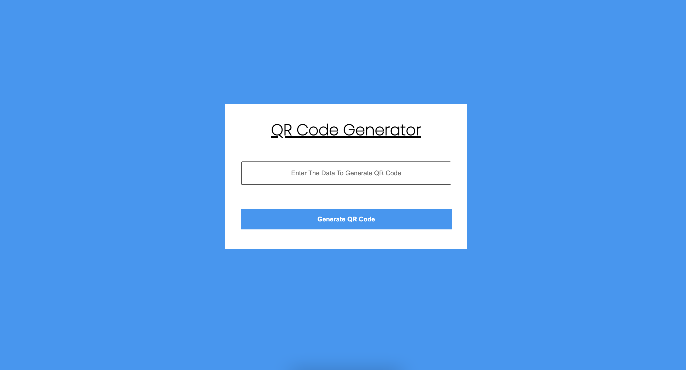

# QR-CODE GENERATOR

## TECH-STACK

## CONCEPT
<ol>
 <li>Learn about fetch api</li>
 <li>querySelector</li>
 <li>addEventListener</li>
 <li>Html</li>
 <li>Css flex-box</li>
</ol>

## UI of the Project

